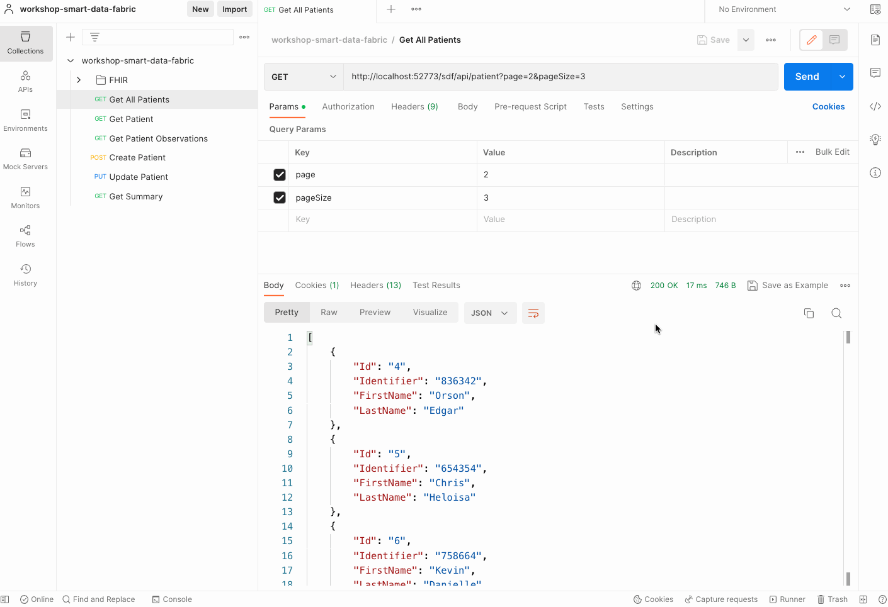
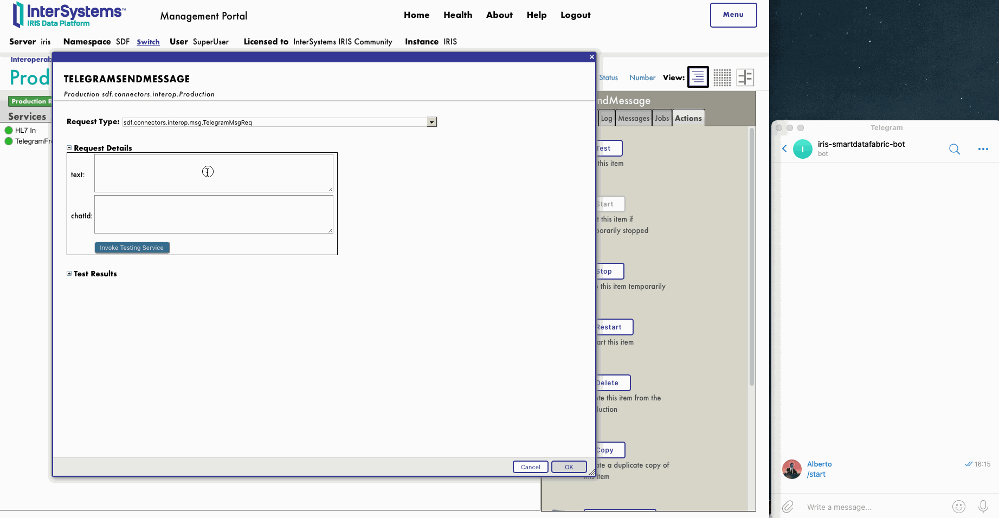
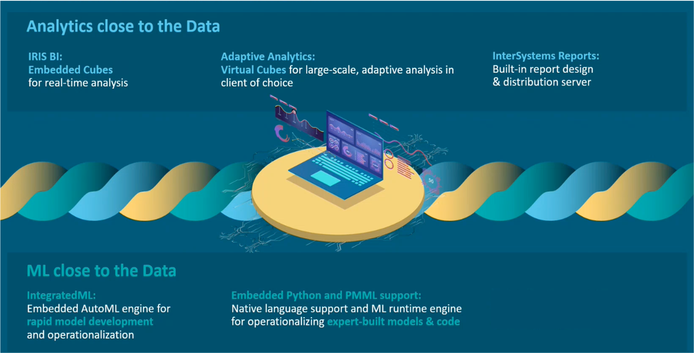
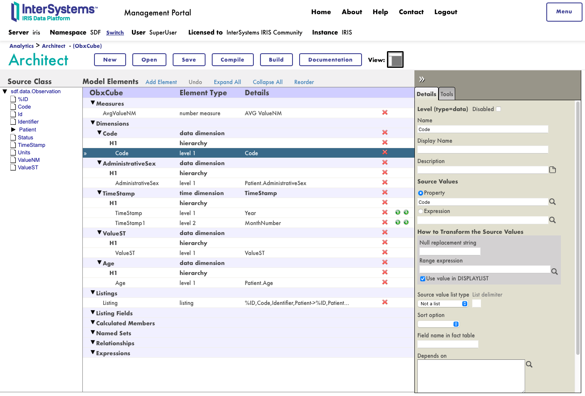
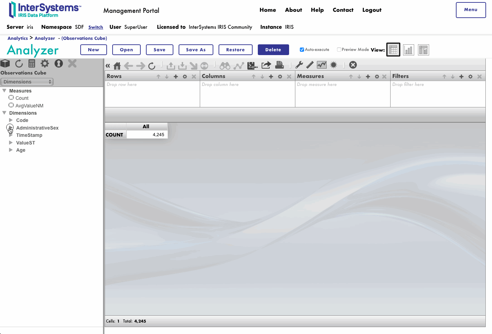
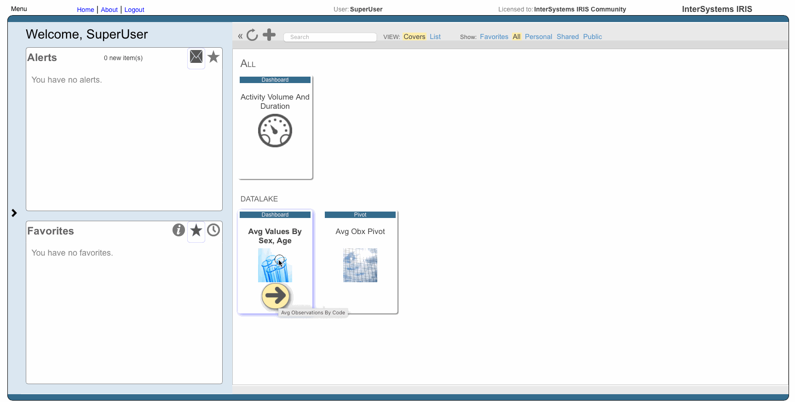
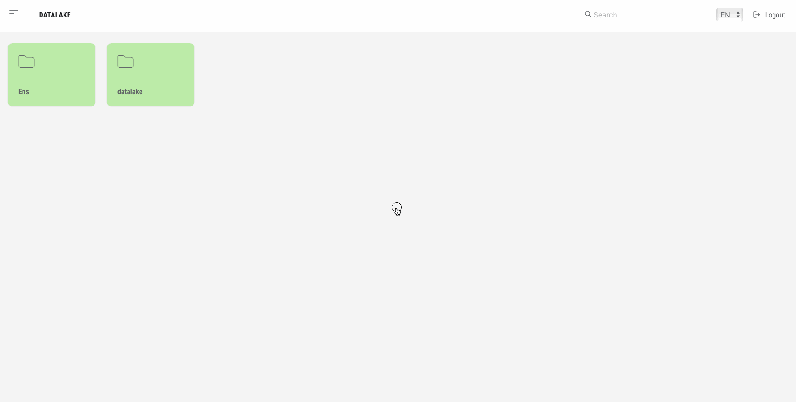
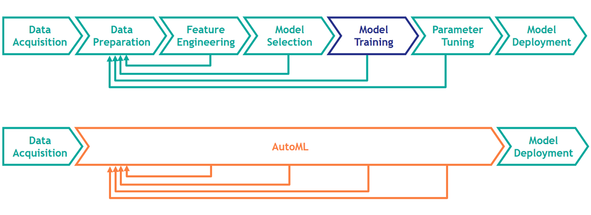
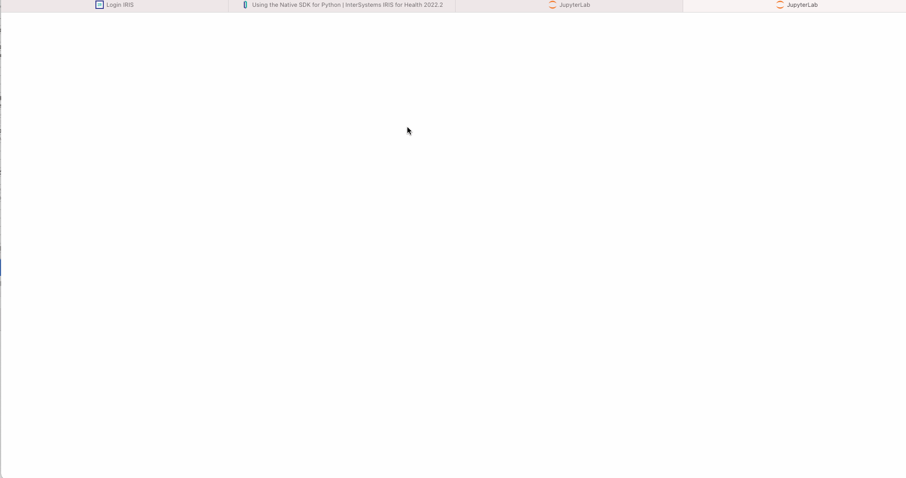

Learn the main ideas involved in developing a DataLake using InterSystems IRIS.


# Learn the basics
👉 We will combine different features of InterSystems IRIS such as multi-model database, interoperability and analytics.

If you are not too familiar with InterSystems IRIS technology, you can get a hands-on overview with these resources:
* Learn about InterSystems IRIS and **Docker containers** - [workshop-containers-intro](https://github.com/intersystems-ib/workshop-containers-intro)
* Learn how to use InterSystems IRIS and Visual Studio Code - [workshop-vscode-iris](https://github.com/intersystems-ib/workshop-vscode-iris)
* A very simple introduction to InterSystems IRIS **multi-model database** -  [workshop-multimodel-intro](https://github.com/intersystems-ib/workshop-multimodel-intro)
* An overview of **interoperability** using IRIS - [workshop-interop-intro](https://github.com/intersystems-ib/workshop-interop-intro)
* Analytics & BI in a nutshell with IRIS - [workshop-iris-bi-intro](https://github.com/intersystems-ib/workshop-iris-bi-intro)

# What do you need to install? 
* [Git](https://git-scm.com/downloads) 
* [Docker](https://www.docker.com/products/docker-desktop) (if you are using Windows, make sure you set your Docker installation to use "Linux containers").
* [Docker Compose](https://docs.docker.com/compose/install/)
* [Visual Studio Code](https://code.visualstudio.com/download) + [InterSystems ObjectScript VSCode Extension](https://marketplace.visualstudio.com/items?itemName=daimor.vscode-objectscript)

# Setup
Clone the GitHub repository to your local computer. This will allow you to acces the code and build the samples:
```
git clone https://github.com/intersystems-ib/workshop-iris-datalake
``` 

Build the image we will use during the workshop:
```
docker-compose build
```

Run the container:
```
docker-compose up -d
```

You should be able to access [InterSystems IRIS Management Portal](http://localhost:52773/csp/sys/UtilHome.csp) and login using `superuser` / `SYS`.

# Environment
We are going to use an environment using Docker containers. 


* [docker-compose](docker-compose.yml) - set up the containers (services) we are using. In this case, we are using only an InterSystems IRIS container.
* [Dockerfile](Dockerfile) - this file defines how we are building our InterSystems IRIS Container. We will start from an InterSystems IRIS For Health Community version, copy some directories, set up some permissions and finally call iris.script to run whatever we need within IRIS.
* [iris.script](iris.script) - script that runs the setup we need in IRIS, e.g. installing applications, loading source code, etc.

After running the environment, you can access to an interactive sesion on IRIS container using:
```
docker-compose exec -it iris bash
```

You can also have a look at the container logs using:
```
docker logs iris
```

# Data model
Have a look at the main classes of our data model:
* [Patient](src/datalake/data/Patient.cls) will store patient definitions
* [Observation](src/datalake/data/Observation.cls) will store different kind of observations for the patients (e.g. diastolic bp, systolic bp, body temperature, etc.)

Our classes are [persistent](https://docs.intersystems.com/irisforhealth20222/csp/docbook/Doc.View.cls?KEY=GOBJ_persobj_intro). That means that they can store data, and in InterSystems IRIS we will be able to work with them using objects as well as SQL automatically.

These classes also use [Relationships](https://docs.intersystems.com/irisforhealth20222/csp/docbook/Doc.View.cls?KEY=GOBJ_relationships) and some [Indexes](https://docs.intersystems.com/irisforhealth20222/csp/docbook/Doc.View.cls?KEY=GOBJ_relationships). They can also contain methods and logic.

Go to [System Explorer > SQL (DATALAKE)](http://localhost:52773/csp/sys/%25CSP.Portal.Home.zen?$NAMESPACE=DATALAKE&$NAMESPACE=DATALAKE&#), locate the tables corresponding to our persistent classes and display them. They should be empty.


We manipulate data using SQL or Objects. Let's create some simple data using objects through the [WebTerminal](http://localhost:52773/terminal/)

First, create a patient object:

```objectscript
    set patientObj = ##class(datalake.data.Patient).%New()
    set patientObj.Identifier = "12345"
    set patientObj.FirstName = "John"
    set patientObj.LastName = "Doe"
```

Then, create an observation for the patient:

```objectscript
    set obxObj = ##class(datalake.data.Observation).%New()
    set obxObj.Code = "BodyTemp"
    set obxObj.Value = "36"
    set obxObj.Units = "C"
```

Finally, insert the observation into the patient record and save it

```objectscript
    do patientObj.Observations.Insert(obxObj)
    set sc = patientObj.%Save(1)
    write !,"statusCode=",sc
```

After that, try to run SQL queries again. You can also take advantage of [Implicit Joins (Arrow Syntax)](https://docs.intersystems.com/irisforhealth20222/csp/docbook/Doc.View.cls?KEY=GSQL_implicitjoins):

```sql
SELECT 
Patient->FirstName, Patient->LastName,Code, Units, Value
FROM datalake_data.Observation
```

After your tests, delete all the data you have just created:

```objectscript
    write ##class(datalake.data.Observation).%KillExtent()
    write ##class(datalake.data.Patient).%KillExtent()
``` 

# Ingestion

## Data
* In our example, we are going to use a set of HL7 files that have been generated inspired on [Maternal Health Risk Data](https://www.kaggle.com/datasets/csafrit2/maternal-health-risk-data) dataset on Kaggle. These files will be ingested as they were incoming from an external hospital.
* Uncompress [data/hl7files.tar.gz](data/hl7files.tar.gz).

```
cd data
tar -zxvf hl7files.tar.gz
```

## DataPipe and DataPipeUI
* You could implement data ingestion in a lot of different ways. In this example, we will be using a community tool called [DataPipe](https://github.com/intersystems-ib/iris-datapipe) that is already installed in the environment. 
* This will help us on enriching, normalizing and validating the incoming data using InterSystems IRIS interoperability features. 
* Also you can use an user interface [DataPipeUI](https://github.com/intersystems-ib/iris-datapipeUI) to have a look at the incoming data to the system and how it's being handled.
* In a separate terminal in your system, clone the repo and run the [DataPipeUI](https://github.com/intersystems-ib/iris-datapipeUI) container user interface:

```
git clone https://github.com/intersystems-ib/iris-datapipeUI
cd iris-datapipeUI
docker-compose up -d
```

## Try ingesting some data yourself
* In the environment, open the [production](http://localhost:52773/csp/datalake/EnsPortal.ProductionConfig.zen?PRODUCTION=datalake.connectors.interop.Production). It is already running.
* Let's ingest some data.
* Copy some files from [data/hl7files](data/hl7files) into [data/hl7in](data/hl7in).
* You can have a look at the [HL7 messages processed](http://localhost:52773/csp/datalake/EnsPortal.MessageViewer.zen?SOURCEORTARGET=HL7%20In) in the production.
* Access http://localhost:8080 to have a glance at the DataPipeUI
* After processing data, run some SQL queries again.

You can also copy all files using:
```
cd data
cp hl7files/*.hl7 hl7in
```


## DataPipe Model
DataPipe allows you to define an interoperability model with the properties that you need, and then decide how are you going to normalize and validate it. You have to implement a few methods.


In this case, we are using [R01Model.cls](src/datalake/connectors/interop/datapipe/model/R01Model.cls):
* It defines the properties we need for processing incoming ORU^R01 HL7 messages with observations.
* Implements `Serialize` and `Deserialize` methods to serialize and deserialize using JSON format.
* To `Normalize`, it calls [R01Normalize](http://localhost:52773/csp/datalake/EnsPortal.DTLEditor.zen?DT=datalake.connectors.interop.datapipe.dt.R01Normalize.dtl) data transformation.
* To `Validate`, implements some checks on the incoming data.
* Finally, in `RunOperation` implements what are we going to do with the ingested data. In this example it is storing data in `datalake.data.*` classes.

## DataPipe Production
* The [production](http://localhost:52773/csp/datalake/EnsPortal.ProductionConfig.zen?PRODUCTION=datalake.connectors.interop.Production) that is ingesting data, have some elements you should review:
* `HL7 In` - built-in HL7 file Business Service that reads HL7 files from a directory.
* [HL7 Ingestion](http://localhost:52773/csp/datalake/EnsPortal.BPLEditor.zen?BP=datalake.connectors.interop.datapipe.bp.HL7Ingestion.bpl) - Business Process that: 
  * Extract attributes (metadata) from incoming HL7 message using [R01ToInboxAttributes](http://localhost:52773/csp/datalake/EnsPortal.DTLEditor.zen?DT=datalake.connectors.interop.datapipe.dt.R01ToInboxAttributes.dtl) data transform.
  * Converts incoming HL7 message into [datalake.connectors.interop.datapipe.model.R01Model.cls](src/datalake/connectors/interop/datapipe/model/R01Model.cls) using [R01ToModel](http://localhost:52773/csp/datalake/EnsPortal.DTLEditor.zen?DT=datalake.connectors.interop.datapipe.dt.R01ToModel.dtl) data transform.
* `HL7 Staging` is a DataPipe business process (`DataPipe.Staging.BP.StagingManager`) that handles the normalization and validation of your DataPipe model.
* `HL7 Oper` is another DataPipe business process (`DataPipe.Oper.BP.OperManager`) that handles running your DataPipe model operation.

# Services

Let's create a REST service to interact with your `datalake.data.*` classes. But first, we can start by working with JSON.

## JSON

### %JSON.Adaptor
Your `datalake.data.*` classes already extends from [%JSON.Adaptor](https://docs.intersystems.com/irisforhealth20222/csp/docbook/Doc.View.cls?KEY=GJSON_adaptor). It provides some nice features for importing and exporting your objects to and from JSON.

Open a [WebTerminal](http://localhost:52773/terminal/) session and try the following:

Open an object and export to JSON:

```objectscript
    // open an object from a persistent class
    set patient = ##class(datalake.data.Patient).%OpenId(1)
    // directly, export to json to current device
    do patient.%JSONExport()
```

Now, let's try to format the JSON for our object:

```objectscript
    // export patient object to a json string
    do patient.%JSONExportToString(.json)
    // instantiate a json formatter
    set formatter = ##class(%JSON.Formatter).%New()
    do formatter.FormatToString(json, .formattedJson)
    // print formatted json
    write formattedJson
```

In your [datalake.data.Patient](src/datalake/data/Patient.cls) class, change the `%JSONREFERENCE` attribute from `ID` to `OBJECT` or viceversa and try again the following:

```objectscript
    // delete previous in-memory object definition
    kill patient
    // re-open object (so it can load your change on %JSONREFERENCE)
    set patient = ##class(datalake.data.Patient).%OpenId(1)
    // export to a formatted json string
    do patient.%JSONExportToString(.json)
    do formatter.FormatToString(json, .formattedJson)
    // print your json string
    write formattedJson
```

Can you tell the difference between using `ID` or `OBJECT`?

⚠️ **Important!** Before going on, be sure your [datalake.data.Patient](src/datalake/data/Patient.cls) class has `(%JSONREFERENCE = "ID")` defined.

[%JSON.Adaptor](https://docs.intersystems.com/irisforhealth20222/csp/docbook/Doc.View.cls?KEY=GJSON_adaptor) has a lot of nice features that allows you to export and import and customize those behaviours. We'll use them in the REST service we will implement.

`%JSON.Adaptor` is a nice approach if you have already defined classes that you want to serialize or deserialize to JSON format.

### %DynamicObjects

[%DynamicObjects](https://docs.intersystems.com/irisforhealth20222/csp/docbook/DocBook.UI.Page.cls?KEY=GJSON_create) allows you to work with JSON structures without having a previous definition (dynamically).

In your [WebTerminal](http://localhost:52773/terminal/) session try the following:

```objectscript
    set dynamicObject = {"prop1":"a string value"}
    write dynamicObject.prop1

    set dynamicArray = [[1,2,3],{"A":33,"a":"lower case"},1.23456789012345678901234,true,false,null,0,1,""]
    write dynamicArray.%ToJSON()
```

Have a look at the documentation section [Using JSON in ObjectScript](https://docs.intersystems.com/irisforhealth20222/csp/docbook/DocBook.UI.Page.cls?KEY=GJSON_intro) to have an overview of all the options you have available with `%JSON.Adaptor` or `%DynamicObjects`.


## REST Service

There are different ways of implement REST services in InterSystems IRIS. We will implement a `%CSP.REST` service. Don't forget to check the documentation section [Introduction to Creating REST Services](https://docs.intersystems.com/irisforhealth20222/csp/docbook/Doc.View.cls?KEY=GREST_intro) to have a full view.

Open [datalake.connectors.api.DataEndpoint](src/datalake/connectors/api/DataEndpoint.cls). This will be our service for accesing some of our `datalake.data.*` classes.

Review the different methods that are implemeted and try to figure out what are they doing.

REST services needs a web application that forwards HTTP requests to them, in this case we have the [/datalake/api](http://localhost:52773/csp/sys/sec/%25CSP.UI.Portal.Applications.Web.zen?PID=%2Fdatalake%2Fapi) web application.

Also, in [iris.script](iris.script) you will find how this web application is imported during the container image build for the environment.

Finally, try your service using **Postman**. Import the [workshop-iris-datalake.postman_collection.json](workshop-iris-datalake.postman_collection.json) included in the repository and try the different requests:



## Embedded Python
Embedded Python allows you to use Python to program InterSystems IRIS applications. You can even mix ObjectScript methods and Python methods and refer to objects created in either language! And of course you could use any Python libraries on your implementation. Check the documentation section [Using Embedded Python](https://docs.intersystems.com/irisforhealth20222/csp/docbook/DocBook.UI.Page.cls?KEY=AEPYTHON) to have a full view on this topic.

We are going to use Embedded Python to implement in our REST service an operation that will return an Excel file with the observations for an specific patient. We will take advantage of [openpyxl](https://openpyxl.readthedocs.io/en/stable/) Python library to create Excel files:
* REST service will handle `/patient/:id/observations/xls` requests to return an Excel file.
* [datalake.connectors.api.DataEndpoint](src/datalake/connectors/api/DataEndpoint.cls):`GetPatientObservationsExcel` method will run a SQL query, create a result set and convert it to Excel.
* Actual resultset to Excel conversion will be run in [datalake.Utils](src/datalake/Utils.cls):`ResultSetToXls` which is an Embedded Python classmethod that takes advantage of openpyxl](https://openpyxl.readthedocs.io/en/stable/) library.

You can test it accessing to http://localhost:52773/datalake/api/patient/2/observations/xls in your browser.

# Interoperability

We are going to create a Telegram bot and use it to send some notifications about our datalake.

## Telegram bot setup
* Create a Telegram bot using [BotFather](https://t.me/botfather) bot.
```
/newbot
```
Write down your Telegram Bot token.

* Open a new Telegram chat with your brand new Telegram bot. Write some dummy messages.
* Usually, you will process incoming messages to your bot using a WebHook or the getUpdates Telegram API. In this example, we will only focus on sending messages.
* You will need a **chat id** and your **token** to send messages.
* Grab your **chat id** by accesing [https://api.telegram.org/bot<your_token>/getUpdates](https://api.telegram.org/bot<your_token>/getUpdates). You should get a JSON response from Telegram. Look for something like:
```
...
"chat":{"id":<your_chatId>
...
```

## Business operation settings
* Go to [IRIS > Interoperability > Configure > Credentials](http://localhost:52773/csp/datalake/EnsPortal.Credentials.zen?$NAMESPACE=DATALAKE&$NAMESPACE=DATALAKE&) and create a `TelegramBotToken` Credentials with your token as password.
* Go to our [Interoperability Production](http://localhost:52773/csp/datalake/EnsPortal.ProductionConfig.zen?PRODUCTION=datalake.connectors.interop.Production&$NAMESPACE=DATALAKE), select `TelegramSendMessage` operation and set the following:
  * TelegramCredentials: `TelegramBotToken`
  * DefaultTelegramChatId: `your chatId`

You can now test your Telegram Business Operation:



## Calling your Business operation

### Ingestion
You can call your Telegram business operation from the ingestion layer using your Data Pipe model, try to add the following in [R01Model](src/datalake/connectors/interop/datapipe/model/R01Model.cls):

```objectscript
    $$$AddLog(log, "Transaction Commited")

    // you can send messages to other production components (while you are not on an open transaction)
    if $isobject(bOperation) {
        set req = ##class(datalake.connectors.interop.msg.TelegramMsgReq).%New()
        set req.text = "Patient ("_..PatientId_") ingested! 🌡️ "_$number(..ObxValues.GetAt("BodyTemp"),2)_" "_..ObxUnits.GetAt("BodyTemp")
        $$$ThrowOnError(bOperation.SendRequestAsync("TelegramSendMessage", req))
    }
```

### Services
You can also call interoperability components from your REST service context.

Let's call the Telegram business operation from the REST service:
* Service will handle requests to `/summary` to send a summary of the datalake.
* This will be implemented in [DataEndpoint](datalake.connectors.api.DataEndpoint):`GetSummary`.
* In the method, we will call interoperability components. For that you need to start your call instatiating a Business Service that will init the interoperability context.
* We will instantiate [TelegramFromService](datalake.connectors.interop.bs.TelegramFromService) business service. It will simply send a message to our Telegram business operation.

# Analytics



There multiple ways in which you can leverage [analytics & data science](https://docs.intersystems.com/irisforhealthlatest/csp/docbook/DocBook.UI.Page.cls?KEY=PAGE_data_science) using InterSystems IRIS:
- IRIS Business Intelligence - Allows you to embed business intelligence into your applications. You can have a first look at it in [workshop-iris-bi-intro](https://github.com/intersystems-ib/workshop-iris-bi-intro)
- Adaptive Analytics - an optional extension that provides a business-oriented, virtual data model layer between InterSystems IRIS and popular Business Intelligence (BI) and Artificial Intelligence (AI) client tools. You can checkout this Spanish Webinar [Self-Service Analytics y Reporting](https://comunidadintersystems.com/webinar-self-service-analytics-y-reporting).

We will focus on IRIS BI on our first example.

## BI. Defining a Cube
Open [Management Portal > Analytics > Datalake > Architect > Open Observations Cube](http://localhost:52773/csp/datalake/_DeepSee.UI.Architect.zen?$NAMESPACE=DATALAKE&CUBE=ObxCube.cube) and go through the different dimensions and measures defined for a cube based on the observations persistent class.

These dimensions and measures define what kind of analysis can be done using this cube.

Click on **Build** to build the cube based on the data you have loaded previously.



## BI. Analyzer
Then, open [Management Portal > Analytics > Datalake > Analyzer > Open Observations Cube](http://localhost:52773/csp/datalake/_DeepSee.UI.Analyzer.zen?$NAMESPACE=DATALAKE&$NAMESPACE=DATALAKE&) and try different combinations for rows & columns on your analysis pivot table.

You can also open a pre-defined pivot. In your VS Code Import & Compile [AvgObservationsByAge.pivot.dfi](src/datalake/AvgObservationsByAge.pivot.dfi).


## BI. User portal
Finally, you can create dashboards and build widgets based on your analysis pivot tables. In your VS code Import & Compile [AvgObservationsByCode.dashboard.dfi](src/datalake/AvgObservationsByCode.dashboard.dfi).

Then, open [Management Portal > Analytics > Datalake > User Portal > Open Avg Values by Sex, Age Dashboard](http://localhost:52773/csp/datalake/_DeepSee.UserPortal.Home.zen)




## BI. DSW
In [Open Exchange](https://openexchange.intersystems.com) you can find awesome applicatiosn like [DSW](https://openexchange.intersystems.com/package/DeepSeeWeb) that enables a whole new great looking UI for your IRIS BI. 

You can checkout in your example accessing http://localhost:52773/dsw/index.html#/DATALAKE 




## Machine Learning. IntegratedML
Again, there are different ways you can add [Machine Learning features on your InterSystems IRIS Applications](https://docs.intersystems.com/irisforhealth20222/csp/docbook/DocBook.UI.Page.cls?KEY=GIML_Intro):
* IntegratedML - is an InterSystems IRIS features that allows you to leverage automated machine learning functions directly from SQL.
* [PMML](https://docs.intersystems.com/irisforhealth20222/csp/docbook/DocBook.UI.Page.cls?KEY=APMML) - Predictive Modeling Markup Language is an XML-based standard that expresses analytical models. You can express a model using PMML and deploy it in InterSystems IRIS.
* Python libraries - and of course, taking advantage of Embedded Python, you can use Python libraries such as `pandas`, `scikit-learn`, `tensorflow`, etc directly with your IRIS data to implement your ML models.

We will focus on a simple example of [IntegratedML](https://docs.intersystems.com/irisforhealth20222/csp/docbook/Doc.View.cls?KEY=GIML_Intro).



We are still using a dataset inspired on [Maternal Health Risk Data](https://www.kaggle.com/datasets/csafrit2/maternal-health-risk-data) dataset from Kaggle. 

"Inspired" in this particular case means that we won't have all the data available, so the accuracy of our ML model could be better.

In any case, if you are interested on using the whole dataset check out [workshop-integratedml-intro](https://github.com/intersystems-ib/workshop-integratedml-intro).

Now, in our example check the following:
* [MaternalRiskTrain.cls](src/datalake/data/MaternalRiskTrain.cls) - a view that we will use as our training data.
* [MaternalRiskTest.cls](src/datalake/data/MaternalRiskTest.cls) - a view that we will use as our test data for validation.

Go to [Management Portal > Explorer > SQL > DATALAKE](http://localhost:52773/csp/sys/exp/%25CSP.UI.Portal.SQL.Home.zen?$NAMESPACE=DATALAKE) and run the following:

Create a model for predicting the `RiskLevel` column based on your training data:

```sql
CREATE MODEL MaternalModel PREDICTING (RiskLevel) FROM datalake_data.MaternalRiskTrain
```

Train your model using your training data:

```sql
TRAIN MODEL MaternalModel
```

Now, validate your model using your test data:

```sql
VALIDATE MODEL MaternalModel FROM datalake_data.MaternalRiskTest
```

You can check the validation metrics for your model:

```sql
SELECT * FROM INFORMATION_SCHEMA.ML_VALIDATION_METRICS
```

And finally, you can use your model to get predictions:

```sql
SELECT *, PREDICT(MaternalModel) AS PredictedRisk FROM datalake_data.MaternalRiskTest
```


## Jupyter Notebooks
In [docker-compose.yml](docker-compose.yml) has been added a jupyter notebook service so we can connect to IRIS using [IRIS Native SDK for Python](https://docs.intersystems.com/irisforhealth20222/csp/docbook/DocBook.UI.Page.cls?KEY=BPYNAT).

Try the following:
* Open your Jupyter Notebook instance in http://localhost:8888
* Open [IRISPython.ipynb](jupyter/notebooks/IRISPython.ipynb)

Try it! Think about all the available Python ML libraries you could use to analyze your IRIS data from a pure Python context. You can run queries or directly call your IRIS objects methods.



