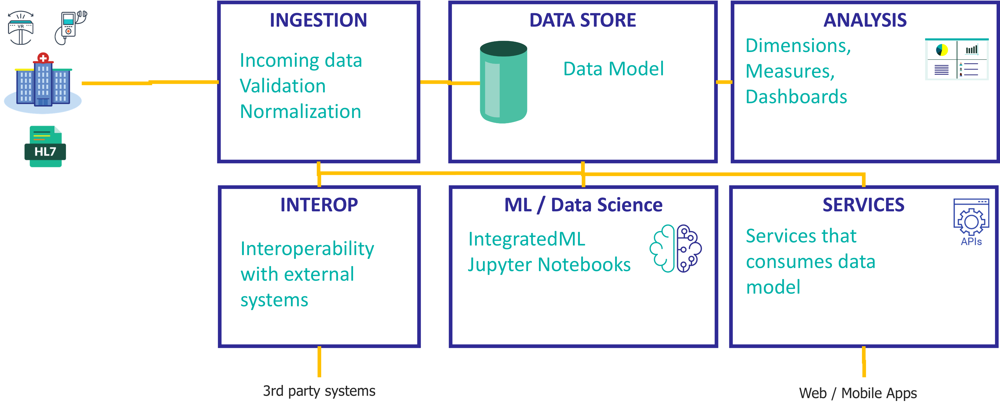
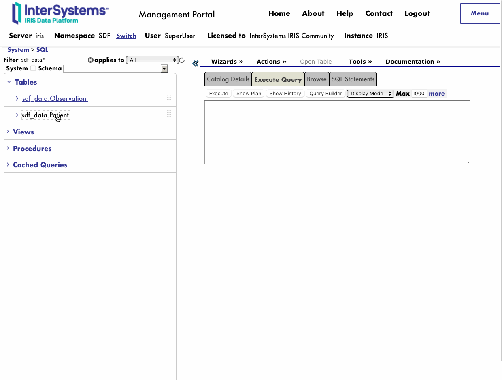

Learn the main ideas involved in developing a DataLake using InterSystems IRIS.



# Learn the basics
👉 We will combine different features of InterSystems IRIS such as multi-model database, interoperability and analytics.

If you are not too familiar with InterSystems IRIS technology, you can get a hands-on overview with these resources:
* Learn about InterSystems IRIS and **Docker containers** - [workshop-containers-intro](https://github.com/intersystems-ib/workshop-containers-intro)
* Learn how to use InterSystems IRIS and Visual Studio Code - [workshop-vscode-iris](https://github.com/intersystems-ib/workshop-vscode-iris)
* A very simple introduction to InterSystems IRIS **multi-model database** -  [workshop-multimodel-intro](https://github.com/intersystems-ib/workshop-multimodel-intro)
* An overview of **interoperability** using IRIS - [workshop-interop-intro](https://github.com/intersystems-ib/workshop-interop-intro)
* Analytics & BI in a nutshell with IRIS - [workshop-iris-bi-intro](https://github.com/intersystems-ib/workshop-iris-bi-intro)

# What do you need to install? 
* [Git](https://git-scm.com/downloads) 
* [Docker](https://www.docker.com/products/docker-desktop) (if you are using Windows, make sure you set your Docker installation to use "Linux containers").
* [Docker Compose](https://docs.docker.com/compose/install/)
* [Visual Studio Code](https://code.visualstudio.com/download) + [InterSystems ObjectScript VSCode Extension](https://marketplace.visualstudio.com/items?itemName=daimor.vscode-objectscript)

# Setup
Clone the GitHub repository to your local computer. This will allow you to acces the code and build the samples:
```
git clone https://github.com/intersystems-ib/workshop-iris-datalake
``` 

Build the image we will use during the workshop:
```
docker-compose build
```

# Environment
We are going to use an environment using Docker containers. 


* [docker-compose](docker-compose.yml) - set up the containers (services) we are using. In this case, we are using only an InterSystems IRIS container.
* [Dockerfile](Dockerfile) - this file defines how we are building our InterSystems IRIS Container. We will start from an InterSystems IRIS For Health Community version, copy some directories, set up some permissions and finally call iris.script to run whatever we need within IRIS.
* [iris.script](iris.script) - script that runs the setup we need in IRIS, e.g. installing applications, loading source code, etc.

docker-compose
Dockerfile
iris.script

# Data model
Have a look at the main classes of our data model:
* [Patient](src/datalake/data/Patient.cls) will store patient definitions
* [Observation](src/datalake/data/Observation.cls) will store different kind of observations for the patients (e.g. diastolic bp, systolic bp, body temperature, etc.)

Our classes are [persistent](https://docs.intersystems.com/irisforhealth20222/csp/docbook/Doc.View.cls?KEY=GOBJ_persobj_intro). That means that they can store data, and in InterSystems IRIS we will be able to work with them using objects as well as SQL automatically.

These classes also use [Relationships](https://docs.intersystems.com/irisforhealth20222/csp/docbook/Doc.View.cls?KEY=GOBJ_relationships) and some [Indexes](https://docs.intersystems.com/irisforhealth20222/csp/docbook/Doc.View.cls?KEY=GOBJ_relationships). They can also contain methods and logic.

Go to [System Explorer > SQL (DATALAKE)](http://localhost:52773/csp/sys/%25CSP.Portal.Home.zen?$NAMESPACE=DATALAKE&$NAMESPACE=DATALAKE&#), locate the tables corresponding to our persistent classes and display them. They should be empty.



We manipulate data using SQL or Objects. Let's create some simple data using objects through the [WebTerminal](http://localhost:52773/terminal/)

First, create a patient object:

```objectscript
    set patientObj = ##class(datalake.data.Patient).%New()
    set patientObj.Identifier = "12345"
    set patientObj.FirstName = "John"
    set patientObj.LastName = "Doe"
```

Then, create an observation for the patient:

```objectscript
    set obxObj = ##class(datalake.data.Observation).%New()
    set obxObj.Code = "BodyTemp"
    set obxObj.Value = "36"
    set obxObj.Units = "C"
```

Finally, insert the observation into the patient record and save it

```objectscript
    do patientObj.Observations.Insert(obxObj)
    set sc = patientObj.%Save(1)
    write !,"statusCode=",sc
```

After that, try to run SQL queries again. You can also take advantage of [Implicit Joins (Arrow Syntax)](https://docs.intersystems.com/irisforhealth20222/csp/docbook/Doc.View.cls?KEY=GSQL_implicitjoins):

```sql
SELECT 
Patient->FirstName, Patient->LastName,Code, Units, Value
FROM datalake_data.Observation
```


# Ingestion

## Data
* In our example, we are going to use a set of HL7 files that have been generated inspired on [Maternal Health Risk Data](https://www.kaggle.com/datasets/csafrit2/maternal-health-risk-data) dataset on Kaggle. These files will be ingested as they were incoming from an external hospital.
* Uncompress (data/hl7files.tar.gz)[data/hl7files.tar.gz].

## DataPipe and DataPipeUI
* You could implement data ingestion in a lot of different ways. In this example, we will be using a community tool called [DataPipe](https://github.com/intersystems-ib/iris-datapipe) that is already installed in the environment. 
* This will help us on enriching, normalizing and validating the incoming data using InterSystems IRIS interoperability features. 
* Also you can use an user interface [DataPipeUI](https://github.com/intersystems-ib/iris-datapipeUI) to have a look at the incoming data to the system and how it's being handled.
* In a separate terminal in your system, clone the repo and run the [DataPipeUI](https://github.com/intersystems-ib/iris-datapipeUI) container user interface:

```
git clone https://github.com/intersystems-ib/iris-datapipeUI
cd iris-datapipeUI
docker-compose up -d
```

